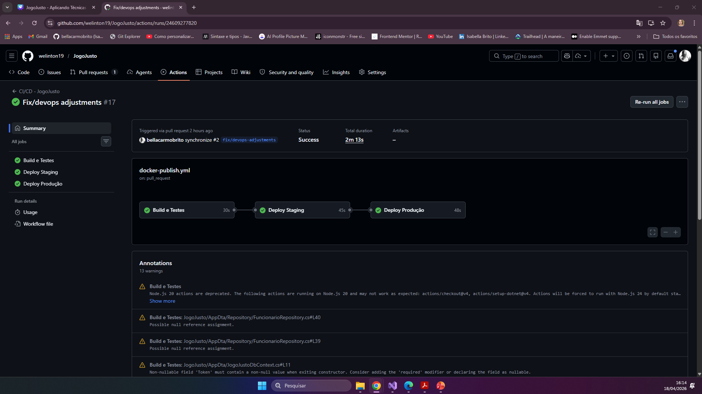
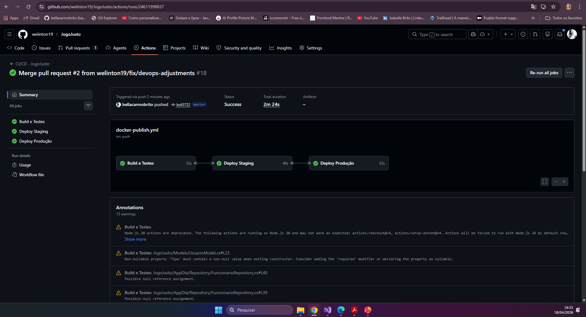
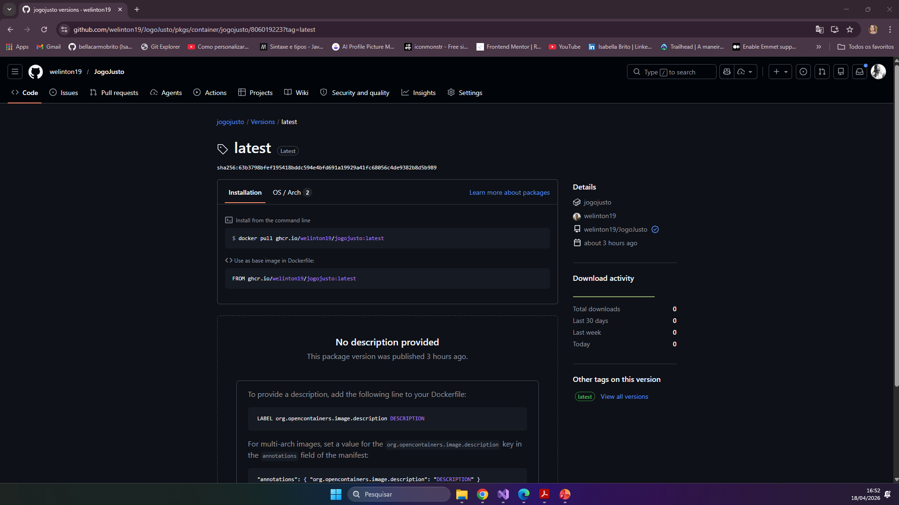
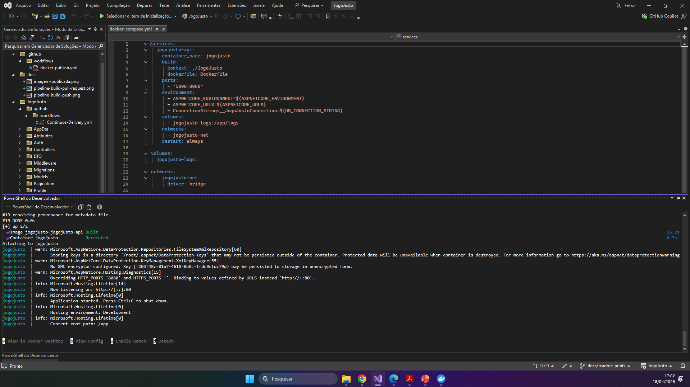
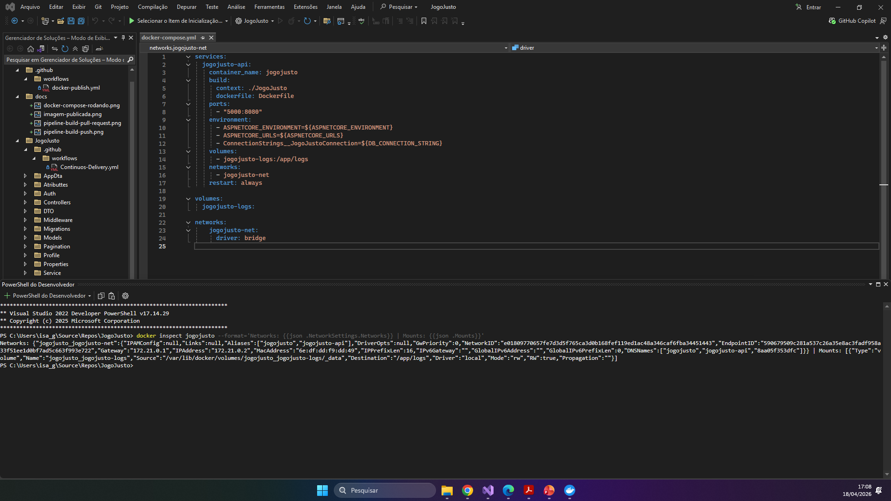

# Projeto - JogoJusto API

**Integrantes:** <br>
Beatriz Silva Rosa - 559606<br>
Isabella Gomes Do Carmo Brito - 560036<br>
Levir Santos - 559328<br>
Marcos Vinicius Jesus Portela - 559958<br>
Welinton Gomes Batista - 559512<br>

**Turma:** 2TDSOS<br>
**Curso:** Análise e Desenvolvimento de Sistemas - FIAP<br>

---

## Sobre o projeto

O **Jogo Justo** é uma plataforma de HRTech voltada à integração e retenção de talentos diversos nas organizações. A solução combina trilhas de capacitação baseadas em microlearning, mentoria com identificação de afinidade cultural e acompanhamento de indicadores ESG para tornar o processo de onboarding mais estruturado, inclusivo e eficiente.

O problema que a plataforma resolve é direto: muitas empresas ainda conduzem o onboarding de forma operacional, sem suporte ao desenvolvimento profissional ou à construção de vínculos organizacionais. Isso gera insegurança, baixo sentimento de pertencimento e aumento do turnover nos primeiros meses de contratação.

A API do Jogo Justo é o núcleo backend da plataforma, responsável por expor os recursos de gestão de usuários, trilhas e indicadores organizacionais, servindo tanto ao portal do colaborador quanto ao painel de RH.

---
## Como executar localmente com Docker

### Pré-requisitos

- [Docker](https://www.docker.com/) instalado
- [Docker Compose](https://docs.docker.com/compose/) instalado

### Passo a passo

1. Clone o repositório:

```bash
git clone https://github.com/welinton19/JogoJusto.git
cd JogoJusto
```

2. Configure as variáveis de ambiente:

```bash
cp .env.example .env
```

Edite o arquivo `.env` com suas credenciais:

```env
ASPNETCORE_ENVIRONMENT=Development
ASPNETCORE_URLS=http://+:80
DB_CONNECTION_STRING=User Id=SEU_RM;Password=SUA_SENHA;Data Source=(DESCRIPTION=(ADDRESS=(PROTOCOL=TCP)(HOST=oracle.fiap.com.br)(PORT=1521))(CONNECT_DATA=(SERVICE_NAME=orcl)));Persist Security Info=True;
```

3. Suba a aplicação:

```bash
docker-compose up --build
```

4. Acesse a API em: `http://localhost:5000`

Para encerrar:

```bash
docker-compose down
```

---

## Pipeline CI/CD

### Ferramenta utilizada

**GitHub Actions** — configurado em `.github/workflows/ci-cd.yml`

### Gatilho

O pipeline é acionado automaticamente em todo `push` ou `pull_request` na branch `master`.

### Etapas do pipeline

#### Job 1 — Build e Testes (`build-and-test`)

- Checkout do código-fonte
- Configuração do .NET 8
- Restauração das dependências via `dotnet restore`
- Build da aplicação em modo `Release`
- Execução dos testes automatizados com `dotnet test`

#### Job 2 — Deploy Staging (`docker-staging`)

- Executado somente após o Job 1 ser concluído com sucesso
- Login no GitHub Container Registry (GHCR)
- Build e push da imagem Docker com a tag `:staging`

#### Job 3 — Deploy Produção (`docker-production`)

- Executado somente após o Job 2 ser concluído com sucesso
- Build e push da imagem Docker com as tags `:latest` e `:<commit-sha>`

### Imagens publicadas

As imagens ficam disponíveis no GHCR:

```
ghcr.io/welinton19/jogojusto:staging
ghcr.io/welinton19/jogojusto:latest
ghcr.io/welinton19/jogojusto:96b7258

```

---

## Containerização

### Dockerfile

O projeto utiliza um **multi-stage build** para gerar uma imagem enxuta e otimizada para produção:

```dockerfile
FROM mcr.microsoft.com/dotnet/aspnet:8.0 AS base
WORKDIR /app
EXPOSE 80
EXPOSE 8081

FROM mcr.microsoft.com/dotnet/sdk:8.0 AS build
ARG BUILD_CONFIGURATION=Release
WORKDIR /src
COPY ["JogoJusto.csproj", "."]
RUN dotnet restore "./JogoJusto.csproj"
COPY . .
RUN dotnet build "./JogoJusto.csproj" -c $BUILD_CONFIGURATION -o /app/build

FROM build AS publish
ARG BUILD_CONFIGURATION=Release
RUN dotnet publish "./JogoJusto.csproj" -c $BUILD_CONFIGURATION -o /app/publish /p:UseAppHost=false

FROM base AS final
WORKDIR /app
COPY --from=publish /app/publish .
ENTRYPOINT ["dotnet", "JogoJusto.dll"]
```

### Estratégias adotadas

- **Multi-stage build:** separa o ambiente de build do ambiente de execução, resultando em uma imagem final menor e sem dependências desnecessárias.
- **Imagem base oficial Microsoft:** garante compatibilidade e atualizações de segurança.
- **Variáveis de ambiente:** configuradas via `.env` e referenciadas no `docker-compose.yml`, mantendo credenciais fora do código-fonte.

### docker-compose.yml

```yaml
services:
  jogojusto-api:
    container_name: jogojusto
    build:
      context: ./JogoJusto
      dockerfile: Dockerfile
    ports:
      - "5000:80"
    environment:
      - ASPNETCORE_ENVIRONMENT=${ASPNETCORE_ENVIRONMENT}
      - ASPNETCORE_URLS=${ASPNETCORE_URLS}
      - ConnectionStrings__JogoJustoConnection=${DB_CONNECTION_STRING}
    volumes:
      - jogojusto-logs:/app/logs
    networks:
      - jogojusto-net
    restart: always

volumes:
  jogojusto-logs:

networks:
  jogojusto-net:
    driver: bridge
```

---

## Prints do funcionamento


- Prints do pipeline rodando no GitHub Actions (build, testes, deploy)



- Print da imagem publicada no GHCR 


- Print do `docker-compose up` rodando localmente


- Print do `docker inspect` mostrando volumes e networks configurados

---

## Tecnologias utilizadas

| Tecnologia | Finalidade |
|---|---|
| C# / .NET 8 | Linguagem e framework da aplicação |
| ASP.NET Core | Framework web para a API REST |
| Oracle Database | Banco de dados relacional |
| Docker | Containerização da aplicação |
| Docker Compose | Orquestração local dos serviços |
| GitHub Actions | Pipeline de CI/CD |
| GitHub Container Registry (GHCR) | Repositório de imagens Docker |

---

## Checklist de Entrega

| Item | Status |
|---|---|
| Projeto compactado em .ZIP com estrutura organizada | ✅ |
| Dockerfile funcional | ✅ |
| docker-compose.yml com volumes e networks | ✅ |
| Pipeline com etapas de build, teste e deploy | ✅ |
| README.md com instruções e prints | ✅ |
| Documentação técnica com evidências (PDF ou PPT) | ✅ |
| Deploy realizado nos ambientes staging e produção | ✅ |
